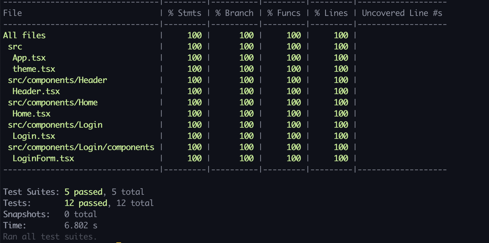
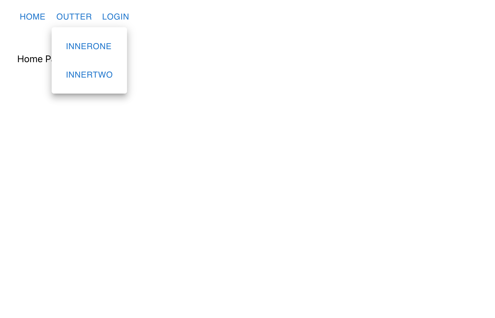
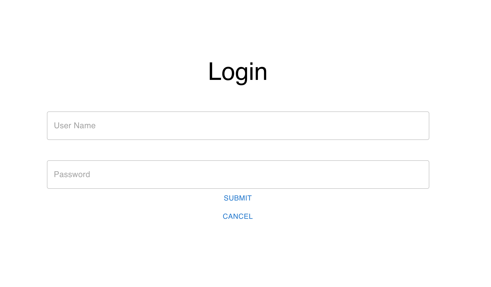

# Login Page
This project was bootstarpped with 
[Create React App](https://github.com/facebook/create-react-app) and
[Create React App Adding TypeScript](https://create-react-app.dev/docs/adding-typescript/).

## Teck Stack
- HTML5
- CSS3
- React JS
- TypeScript
- Material UI
- Formik
- Yup
- Axios
- React Testing Library
- Jest

## Before launch this application
1. Node.js v14 is installed.
2. Configuration <br>
Create a `.env` file at the root of this repository as follows
```
REACT_APP_API_URL=http://localhost:8000
```
3. Install all dependencies
```
npm install-all
```


## Run Application
```
npm run start-all
```

## User Account
You can use the following information to login.
- username: user
- password: user

## Tests
#### Run tests
```
npm run test-c
```
#### Test Coverage
[]()

## Snapshots
- Home Page
[]()
- Login Page
[]()